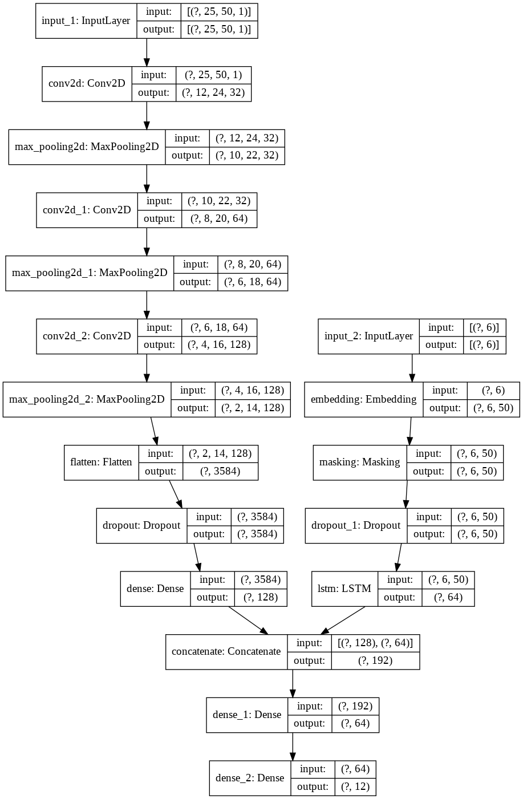

# Digits_sequence_detector

## Short description

Use machine learning to recognize sequences of digits (or simply numbers).
Program can recognize sequences up to 6 digits.

## Model description

The input is grayscale image 50x25.

Output is a string of detected digits (number). First dimension is number of detected digits (number length).
Second dimension is 12 because we have 10 digits, but also START and END symbols.

## Setup

Simply use Google Colaboratory, it's very good data science environment.

## Gathering data and training

You can gather data and train model in 3 ways:

1. Create synthetic data using different fonts.
2. Create synthetic data by concatenating MNIST digits.
3. You can also use your own, custom training data (created screenshots).

Text cells and code are self-explanatory.
If you want to change number of generated synthetic samples, you must change SAMPLES variable.
